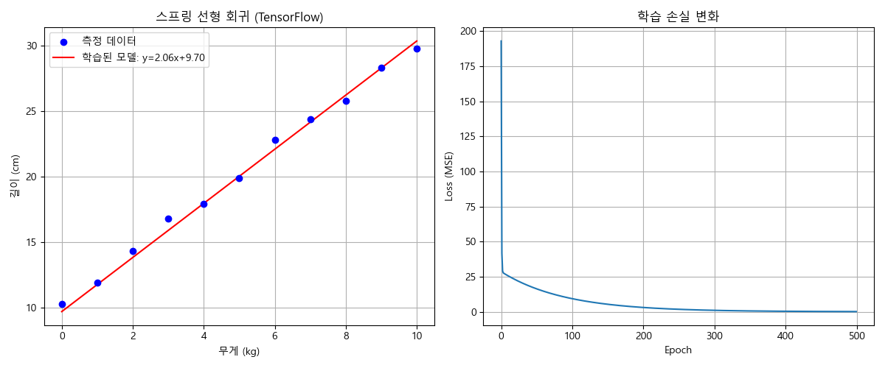
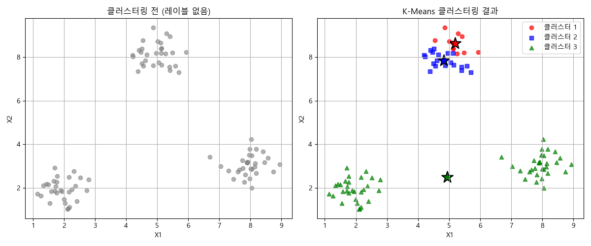
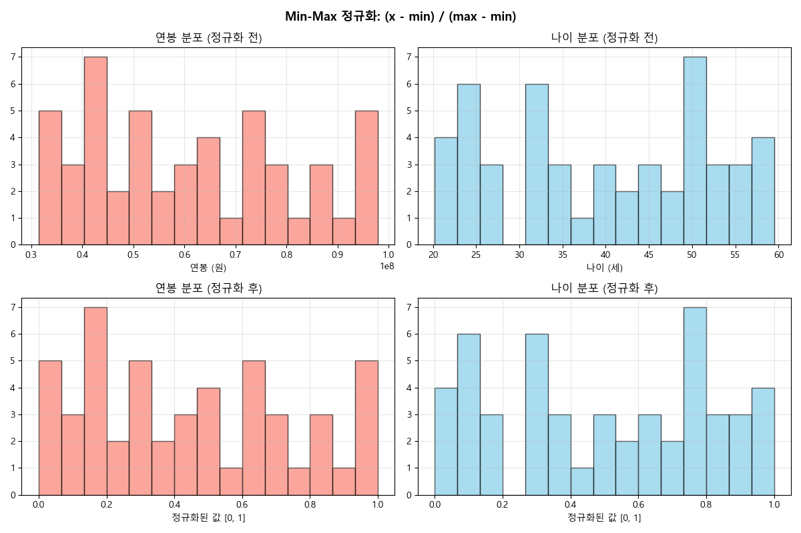
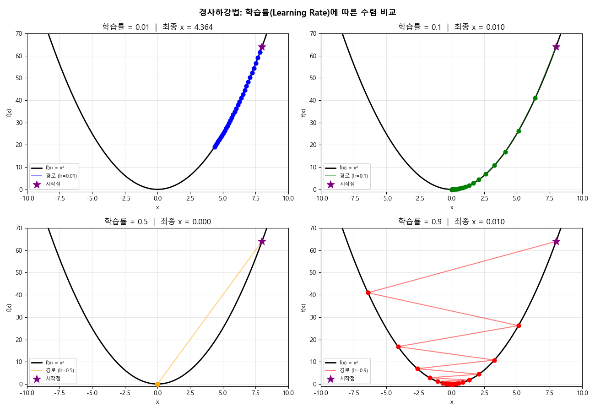
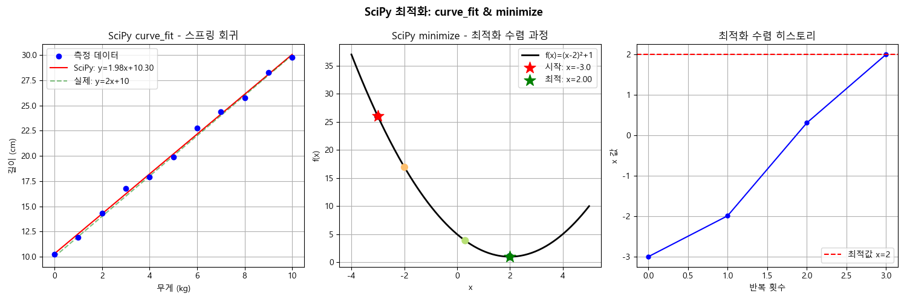

# Week 2: Machine Learning Basics

머신러닝의 핵심 개념을 직접 구현하며 학습한 5개의 실습 기록입니다.

---

## 목차
1. [Lab 1 - 선형 회귀 (TensorFlow)](#lab-1)
2. [Lab 2 - K-Means 클러스터링](#lab-2)
3. [Lab 3 - 데이터 정규화](#lab-3)
4. [Lab 4 - 경사하강법 시각화](#lab-4)
5. [Lab 5 - SciPy 최적화](#lab-5)

---

## Lab 1 - 선형 회귀: 스프링 실험 (TensorFlow) <a name="lab-1"></a>

**파일:** `01_linear_regression_spring.py`

### 개념
훅의 법칙(`길이 = 2 × 무게 + 10`)을 모르는 상태에서 측정 데이터만으로 TensorFlow가 규칙을 스스로 학습.

### 핵심 코드
```python
model = tf.keras.Sequential([
    tf.keras.layers.Dense(units=1, input_shape=[1])
])
model.compile(optimizer='sgd', loss='mean_squared_error')
model.fit(weights, measured_lengths, epochs=500)
```

### 실행 결과
| 파라미터 | 학습값 | 실제값 |
|---------|--------|--------|
| 기울기 (w) | 2.0636 | 2.0 |
| 절편 (b) | 9.6959 | 10.0 |

- 무게 6.5kg 예측 길이: **23.11 cm**



---

## Lab 2 - 비지도학습: K-Means 클러스터링 <a name="lab-2"></a>

**파일:** `02_unsupervised_clustering.py`

### 개념
레이블(정답) 없이 데이터의 패턴만으로 자동 군집화. NumPy로 K-Means 알고리즘을 직접 구현.

### 알고리즘 흐름
1. 초기 중심점(centroid) 랜덤 설정
2. 각 데이터를 가장 가까운 중심에 할당
3. 중심점을 해당 클러스터의 평균으로 업데이트
4. 수렴할 때까지 2~3 반복

### 실행 결과
| 클러스터 | 데이터 수 | 중심 좌표 |
|---------|---------|---------|
| 클러스터 1 | 11개 | [5.20, 8.63] |
| 클러스터 2 | 19개 | [4.83, 7.84] |
| 클러스터 3 | 60개 | [4.94, 2.48] |

- 90개 데이터, **3번 반복만에 수렴**



---

## Lab 3 - 데이터 전처리: Min-Max 정규화 <a name="lab-3"></a>

**파일:** `03_data_preprocessing.py`

### 개념
스케일이 다른 특성들을 동일한 [0, 1] 범위로 통일하여 모델이 특정 특성에 편향되지 않도록 함.

### 공식
$$x_{norm} = \frac{x - x_{min}}{x_{max} - x_{min}}$$

### 실행 결과
| 특성 | 정규화 전 범위 | 정규화 후 범위 |
|-----|-------------|-------------|
| 연봉 | 3,144만원 ~ 9,789만원 | 0.0 ~ 1.0 |
| 나이 | 20.2세 ~ 59.5세 | 0.0 ~ 1.0 |

- 정규화 전 스케일 차이: **약 169만 배**
- 정규화 후: 두 특성이 동등한 비중으로 학습에 기여



---

## Lab 4 - 경사하강법 시각화 <a name="lab-4"></a>

**파일:** `04_gradient_descent_vis.py`

### 개념
AI 학습의 핵심 메커니즘. 손실 함수의 기울기(gradient) 반대 방향으로 파라미터를 조금씩 이동하며 최솟값 탐색.

### 업데이트 공식
```
x_new = x - learning_rate × gradient(x)
```

### 실행 결과 (학습률 = 0.1, 시작점 x = 8.0)
| 반복 | x 값 | Loss |
|-----|------|------|
| 0 | 8.0000 | 64.000000 |
| 1 | 6.4000 | 40.960000 |
| 5 | 2.6214 | 6.871948 |
| 10 | 0.8589 | 0.737450 |
| 30 | 0.0099 | 0.000098 |

- 학습률 0.01 / 0.1 / 0.5 / 0.9 에 따른 수렴 속도 및 안정성 비교



---

## Lab 5 - SciPy를 이용한 수치 최적화 <a name="lab-5"></a>

**파일:** `05_scipy_optimization.py`

### 개념
TensorFlow의 반복적 경사하강법 vs SciPy의 수학적 최적화 알고리즘(BFGS) 비교.

### Part A - curve_fit으로 스프링 회귀
```python
popt, pcov = curve_fit(linear_func, weights, measured_lengths)
# 결과: a=1.9767, b=10.2991
```

### Part B - minimize로 수치 최적화
```python
result = minimize(objective_func, x0=[-3.0], method='BFGS')
# 결과: x=2.000000, f(x)=1.000000 (단 3번만에 수렴)
```

### TensorFlow vs SciPy 비교
| 항목 | TensorFlow | SciPy |
|-----|-----------|-------|
| 접근 방식 | 반복적 경사하강법 | 수학적 최적화 (BFGS) |
| 수렴까지 반복 | 500 epoch | **3번** |
| 유연성 | 복잡한 모델 가능 | 간단한 함수에 적합 |
| 주요 용도 | 딥러닝 | 수치 해석 |



---

## 핵심 학습 내용 정리

| 개념 | 설명 |
|-----|-----|
| **지도학습** | 레이블(정답)이 있는 데이터로 학습 (Lab 1, 5) |
| **비지도학습** | 레이블 없이 패턴 발견 (Lab 2) |
| **데이터 전처리** | 데이터 준비가 성능의 80%를 결정 (Lab 3) |
| **경사하강법** | AI 학습의 핵심 최적화 메커니즘 (Lab 4) |
| **프레임워크 비교** | 딥러닝(TF) vs 수치해석(SciPy)의 장단점 (Lab 5) |

## 실행 환경
- Python 3.13
- TensorFlow 2.21.0
- NumPy, SciPy, Matplotlib
